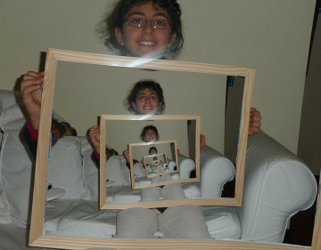

<h1 align="center">tententoon</h1>

<p align="center"><em>noun</em>&nbsp;&nbsp;·&nbsp;&nbsp;a self-repeating image whose copies spiral as they shrink — in the manner of M.&nbsp;C.&nbsp;Escher's <em>Print&nbsp;Gallery</em> (1956).</p>

<p align="center">
from the Dutch title <em>Pren<b>tententoon</b>stelling</em> — <em>prenten</em> (prints) + <em>tentoonstelling</em> (exhibition),<br>
with the coined word sitting right where the two halves meet.<br>
A browser tool for making the same move with your own images.
</p>

---

## Same picture, two infinities

<table>
<tr>
<td align="center" width="50%"></td>
<td align="center" width="50%"></td>
</tr>
<tr>
<td align="center"><strong>Droste</strong> — a picture inside itself, dropping <em>straight down</em> forever.<br><sub>(this one is a real photograph)</sub></td>
<td align="center"><strong>tententoon</strong> — the same recursion, <em>bent into a spiral</em> that still closes seamlessly.</td>
</tr>
</table>

> Same rule — a copy inside a copy inside a copy. One drops straight down; the other takes the scenic route, and still arrives on time.

## The idea

Nest a picture inside itself and you get the **Droste effect**: each copy sits squarely inside the last, shrinking by the same step, forever.

A **tententoon** asks one stranger question — *what if each copy also turns as it shrinks?* The nested frames then wind into a spiral. Straight lines bow into curves, the whole picture twists, and yet nothing tears: follow any line inward and it meets itself exactly.

The trick is a single move — **take the logarithm.** Shrinking-and-repeating is multiplication, and logarithms turn multiplication into addition, so "shrink, then repeat" becomes "slide over, then repeat" — a plain, evenly-spaced grid. Add rotation and that grid simply *tilts*; roll it back up and the tilt is a spiral. The loop is seamless because, in log-space, one full turn is just a shift by exactly one step — landing you on an identical picture.

**→ The whole story — why it spirals, and why it never tears:** [silvio-tententoon.pgs.sh/explain.html](https://silvio-tententoon.pgs.sh/explain.html)

## Where the name comes from

Escher drew *Print Gallery* by hand in 1956 and left a white blot at its centre — the spiral grew too tight to finish. In 2003, **Hendrik Lenstra** and **Bart de Smit** found the exact map behind it: the idealised picture contains a copy of itself rotated **157.6256°** and shrunk by **22.5837×**. With those two numbers, they completed the picture by computer. In 2026, **3Blue1Brown** turned the whole argument into a [beautifully animated video](https://www.youtube.com/watch?v=ldxFjLJ3rVY).

## Make one

Drop in any photo, draw the rectangle where the next copy should sit, and flip between the two infinities — the straight Droste fall or the tententoon spiral. Export the loop as a PNG, GIF, or video. Everything runs in your browser: no upload, no account, no server.

**Live:** [silvio-tententoon.pgs.sh](https://silvio-tententoon.pgs.sh/)

---

<details>
<summary><strong>Run it locally</strong></summary>

```sh
npm install      # or: bun install
npm run dev      # or: bun run dev   → open the URL Vite prints
npm run build    # → dist/
npm run preview  # serve dist/ locally
```

Svelte 5 (runes) + Vite. Rendering is WebGL via [twgl.js](https://twgljs.org/) with a CPU-worker fallback; exports use `<canvas>.toBlob` (PNG), `MediaRecorder` (MP4/WebM), and [`gifenc`](https://github.com/mattdesl/gifenc) (GIF). No backend by design.

</details>

## Credits & licence

- **Print Gallery** / *Prentententoonstelling* — M. C. Escher, 1956. Escher's works are © The M. C. Escher Company; referenced here by description and link, not reproduced.
- **The mathematical completion** — Bart de Smit & Hendrik Lenstra, *The Mathematical Structure of Escher's Print Gallery*, [Notices of the AMS, 2003](https://www.ams.org/notices/200304/fea-escher.pdf).
- **Demo image** — *Droste effect* by [Nevit Dilmen](https://commons.wikimedia.org/wiki/File:Droste_1260359-nevit.jpg), [CC BY-SA 3.0](https://creativecommons.org/licenses/by-sa/3.0/) (see `public/ATTRIBUTION.txt`).
- **Code** — [AGPLv3 or later](LICENSE) (the sample image keeps its own CC BY-SA 3.0 licence).
