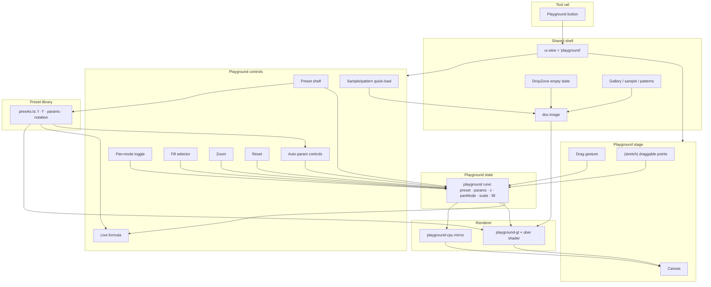

# Complex Playground — Shaping

## Source

> Create a new "complex playground" page. You should be able to epxeriment with a
> few complex transformations on any image in your gallery or the sample image or
> grid/circles patterna.

> Make it like a geogebra graph, with ui to change values. Keep the hand-scrolling:
> it should influence the formula with an addition of a complex number. It needs to
> be fun to explore. Include some ready made formulas that could be cool.

---

## Problem

The app maps images through exactly one complex transformation — the Droste/Escher
log-polar spiral — and every control is wired to that one map. There is no place to
play with complex-plane functions in general: to swap in `z²`, `1/z`, a Möbius map,
or `exp(z)`, tweak their parameters, and watch a photo (or the test patterns) warp in
real time. The existing `pipeline` view is the closest thing, but it's locked to the
Droste pipeline, its "pan" is a log-space `(u, v)` shift (not a complex `+c`), and it
shows no editable formula.

## Outcome

A dedicated, GeoGebra-flavoured playground where you:

- Load any image the app already knows (a gallery picture, the bundled sample, or the
  generated grid/polar patterns) onto a complex plane.
- Pick a "cool" complex function from a preset shelf and watch the image transform.
- Change the function's values with live on-screen controls and see it update instantly.
- Keep the familiar hand-drag, now repurposed: dragging adds a complex constant `c` to
  the active formula — the displayed formula and the image both respond as you scroll.
- Have fun: it's immediate, smooth, and the presets are worth a "whoa".

---

## Decisions (locked 2026-05-30)

| # | Decision | Choice |
|---|----------|--------|
| D1 | Formula model | **Shape A — curated presets.** No free-form typing (R8 → Out; B/C dropped). |
| D2 | Pan `c` composition | **Toggle both** — switch between domain `f(z+c)` and output `f(z)+c`. Default: domain. |
| D3 | Mount | **New `ViewMode 'playground'`** in the existing shell; reuse TopBar / Gallery / DropZone (sample + patterns) / `doc.image`. |

Defaulted (vetoable) — see Detail A:
- **Origin** fixed at image centre for v1; draggable is a stretch.
- **Controls** are sliders + number fields for v1; draggable on-canvas points (zeros/poles) are a stretch.
- **Fill** offers tile (default) · clamp · mirror; the Droste self-similar fold is an optional bonus mode.
- **AA** via per-preset analytic `|f'(z)|` → mip LOD; internal render resolution capped during drag.

---

## Requirements (R)

| ID | Requirement | Status |
|----|-------------|--------|
| R0 | A dedicated playground to apply a chosen complex function `f(z)` to an image and explore the result live | Core goal |
| R1 | Works on any image the app can already provide — a gallery picture, the bundled sample, or the generated grid/polar test patterns | Must-have |
| R2 | GeoGebra-style live controls: each function exposes its parameters as on-screen controls (sliders / number fields, ideally draggable points); changing a value re-renders immediately; one action resets to defaults | Must-have |
| R3 | 🟡 The existing hand-drag is kept but repurposed: dragging feeds a complex constant `c` into the active formula. A **toggle** picks whether `c` attaches to the **domain** `f(z+c)` or the **output** `f(z)+c`. Image + displayed formula update live as you drag | Must-have |
| R4 | The active formula is shown in readable notation and updates as parameters / pan change | Must-have |
| R5 | A one-click shelf of ready-made "cool" complex functions (e.g. `z²`, `1/z`, Möbius, Joukowski, `exp`, `log`, Escher power `zᵃ`, `zⁿ`) | Must-have |
| R6 | Fun & immediate: rendering stays smooth and real-time during drag and control changes | Must-have |
| R7 | A sensible pixel↔complex coordinate frame (origin + scale, adjustable); samples that fall outside the image are filled by a tiling/clamp/mirror mode rather than black voids | Must-have |
| R8 | 🟡 ~~Enter an arbitrary complex formula~~ — **Out**: curated presets only (Shape A selected) | Out |

**Notes:**
- Rendering convention (matches the repo's existing maps): for each output pixel at
  complex coord `z`, we **sample the source at `f(z)`** (inverse map). So the on-screen
  warp is what you'd expect from "apply `f`" and every output pixel is covered.

---

## Shapes

### CURRENT: the `pipeline` view (baseline)

The existing 4-panel pipeline view. Fixed log → rotated-log → Escher stages computed
from the Droste nest `doc.rect`. "Pan" is `panU/panV`, a shift in log space. No choice
of function, no formula display, no preset shelf.

| Part | Mechanism | Flag |
|------|-----------|:----:|
| C1 | Fixed Droste pipeline (`pipeline-gl` shader / `pipeline-panels.ts`) driven by `doc.rect` + `drosteGeometry` | |
| C2 | Log-space pan `panU/panV` + angle override (`pipeline-experiments.svelte.ts`) | |
| C3 | Reuses `doc.image` → already gets gallery / sample / pattern sources | |

---

### A: Curated preset playground (uber-shader + sliders + drag-`c`)

A new playground view in the existing shell. A fixed, hand-written library of
parameterised complex functions; one GLSL branch each (the proven `pipeline-gl`
`u_mode` pattern), a CPU mirror for the fallback, auto-generated controls per preset,
a live-rendered formula, and drag → `+c`. No free-text formula parsing.

| Part | Mechanism | Flag |
|------|-----------|:----:|
| **A1** | **Playground view** — new `ViewMode` `'playground'` in the existing shell; reuses TopBar / DropZone (sample + pattern buttons) / Gallery for image sources; swaps the bottom strip for a playground control panel | |
| **A2** | **Playground state** — light `$state`: complex frame (origin px, scale px/unit), active preset id, per-preset param values, pan `c`. Independent of the Droste `doc.rect`; shares only `doc.image` | |
| **A3** | **Complex-op GLSL library** — `cadd/cmul/cdiv/cexp/clog/cpow/csin/…` + an uber fragment shader: one branch per preset computes `f(z)`, shared sampling tail with selectable fill (tile / clamp / mirror) | |
| **A4** | **CPU mirror** — the same presets in JS for the no-GPU fallback (mirrors how `pipeline-panels.ts` mirrors the shader) | |
| **A5** | **Auto-generated controls** — each preset declares a param schema → sliders / number fields rendered from it; reset-to-defaults; (stretch) draggable on-canvas points bound to zeros/poles/centre | ⚠ (draggable points only) |
| **A6** | **Drag → `c`** — pointer drag/scroll writes pan `c` into A2; formula display + render read params + `c` and update live | |
| **A7** | **Preset library data** — `{id, label, latex/notation template, param defs, defaults, f'(z) for AA}`: `z+c`, `z²`, `1/z`, Möbius `(az+b)/(pz+q)`, Joukowski `½(z+1/z)`, `exp`, `log`, Escher `zᵃ` (`a=1−ik`), `zⁿ` | |
| **A8** | **Conformal overlay** [nice-to-have] — faint complex grid / unit circle / singularity markers so the structure reads GeoGebra-style | ⚠ |

---

### B: Free-form formula compiler

GeoGebra-true: a text field where you type `z^2 + c`, parsed and compiled to GLSL/JS on
the fly; sliders auto-appear for free variables. Maximum expressiveness, much larger
build, and unproven in this repo.

| Part | Mechanism | Flag |
|------|-----------|:----:|
| B1 | Same view + state shell as A1 / A2 | |
| B2 | Complex-expression lexer + parser (`z`, `i`, `+ − × ÷`, `^`, parens, named params, `exp/log/sin/…`) | ⚠ |
| B3 | AST → GLSL codegen (and JS for the CPU path) over the complex-op library | ⚠ |
| B4 | Compile-on-edit: GL program relink, params kept as **uniforms** (so drag/slider stay smooth), error surfacing UI | ⚠ |
| B5 | Auto-detect free variables → generate sliders | ⚠ |
| B6 | Pan `c` injected as a bound variable usable in the expression | |
| B7 | Presets become editable starter expressions in the field | |

---

### C: Hybrid (A now + B later)

Preset shelf + sliders + drag-`c` + live formula (all of A) as the on-ramp, **plus** an
editable formula field backed by B's parser/codegen for power users. Most capable;
A's parts are proven, B's parts remain flagged until Spike S1.

Composition: **C = A1–A8 + B2–B5** (the editable field replaces A's read-only formula
display once the compiler exists).

---

## Fit Check

| Req | Requirement | Status | CURRENT | A | B | C |
|-----|-------------|--------|:-------:|:-:|:-:|:-:|
| R0 | Dedicated playground applying a chosen `f(z)` to an image, explored live | Core goal | ❌ | ✅ | ❌ | ✅ |
| R1 | Works on any app image source (gallery / sample / grid+polar patterns) | Must-have | ✅ | ✅ | ✅ | ✅ |
| R2 | GeoGebra-style live controls per function + reset | Must-have | ❌ | ✅ | ❌ | ✅ |
| R3 | Hand-drag feeds a complex `+c` into the active formula; both update live | Must-have | ❌ | ✅ | ❌ | ✅ |
| R4 | Active formula shown in readable notation, updates live | Must-have | ❌ | ✅ | ❌ | ✅ |
| R5 | One-click shelf of ready-made cool functions | Must-have | ❌ | ✅ | ❌ | ✅ |
| R6 | Smooth, real-time during drag and control changes | Must-have | ✅ | ✅ | ❌ | ✅ |
| R7 | Adjustable complex coord frame + non-black fill (tile/clamp/mirror) | Must-have | ❌ | ✅ | ✅ | ✅ |
| R8 | 🟡 Enter an arbitrary complex formula (now **Out** — presets only) | Out | ❌ | ❌ | ❌ | ❌ |

**Selected: Shape A** (D1). B and C are not pursued; kept below for the audit trail.

**Notes:**
- **CURRENT** fails R0/R2/R3/R4/R5: it runs only the fixed Droste map; "pan" is a
  log-space `(u,v)` shift, not a complex `+c`; there is no formula display or preset shelf.
- **A** fails only R8 — by design it is a curated shelf, no free-text entry.
- **B** fails R0/R2/R3/R4/R5/R6 in the fit check because each of those leans on the
  parser/codegen/compile mechanisms (B2–B5), which are **flagged unknowns** (⚠) until
  Spike S1 resolves them. A flagged mechanism can't claim ✅.
- **C** matches A on every provable requirement (its A-half carries R0–R7). Its only
  delta over A is the editable field — the same flagged unknown as B — so C also can't
  claim R8 yet. **Today, A and C are identical except in ambition/sequencing.**
- No shape satisfies **R8** yet. It is gated by Spike S1; until then it stays a fork,
  not a committed requirement.

---

## Spike S1 — complex-expression compiler (gates R8 / Shapes B & C)

> 🟡 **Not pursued.** D1 selected presets-only (Shape A); R8 is Out. Kept for the
> audit trail in case free-form entry is revisited.

### Context
B and C promise free-form formula entry. The risk is not "can we parse" but "can we
recompile without killing R6 (smoothness) and still anti-alias (need `f'`)".

### Questions
| # | Question |
|---|----------|
| **S1-Q1** | What grammar covers the cool cases (`z`, `i`, params, `+−×÷ ^`, `exp/log/sin/conj/…`) with the least surface area? |
| **S1-Q2** | How do we keep params as **uniforms** so editing values never recompiles — only editing the formula *structure* relinks the GL program? |
| **S1-Q3** | How do we get `|f'(z)|` for footprint AA from an arbitrary AST (symbolic diff of the node set, or finite differences in-shader)? |
| **S1-Q4** | What's the error-surfacing UX for a half-typed / invalid expression (last-good program + inline error)? |

### Acceptance
We can describe the grammar, the compile-vs-uniform split, the derivative strategy, and
the error UX — enough to judge whether B's delta over A is worth it.

---

## Component decisions

| # | Decision | Resolution |
|---|----------|------------|
| 1 | Pan composition | **Toggle** domain `f(z+c)` / output `f(z)+c` (D2). Default domain. |
| 2 | Mount | **New `ViewMode 'playground'`** in the shell (D3). |
| 3 | Coordinate origin | Fixed at image centre for v1; **draggable = stretch (V5)**. |
| 4 | Fill mode | Selector **tile (default) · clamp · mirror**; Droste fold = optional bonus. |
| 5 | Controls | **Sliders + number fields** for v1; **draggable points = stretch (V5)**. |
| 6 | Preset set | See **Preset library** below — confirm/trim. |
| 7 | Render res / AA | Cap internal res during drag; AA via per-preset analytic `|f'(z)|` → mip LOD. |

---

## Detail A — Affordances & Wiring

### UI Affordances

| Affordance | Place | Wires Out |
|------------|-------|-----------|
| Playground tool-rail button (5th) | Tool rail | sets `ui.view = 'playground'` |
| Canvas (image warped by `f`) | Stage | reads renderer output |
| Drag gesture on empty canvas | Stage | writes `playground.c` (pan constant) |
| Preset shelf (chips) | Controls | sets `playground.preset` + loads its defaults |
| Auto param controls (sliders / number fields from schema) | Controls | write `playground.params` |
| Pan-mode toggle (domain ⇄ output) | Controls | sets `playground.panMode` |
| Fill selector (tile / clamp / mirror) | Controls | sets `playground.fill` |
| Zoom control (wheel + slider) | Controls / Stage | sets `playground.scale` |
| Reset | Controls | params + `c` ← preset defaults |
| Live formula display | Controls | reads preset + params + `c` → notation |
| Sample / pattern quick-load | Controls | `setImage(…)` |
| Empty drop zone (reused) | Stage | `setImage(…)` |
| (stretch) draggable param points (zero / pole / origin) | Stage | write specific params |
| (stretch) conformal overlay (grid · unit circle · singularities) | Stage | reads frame + preset |

### Non-UI Affordances

| Affordance | Place | Wires Out |
|------------|-------|-----------|
| `playground` `$state` rune (preset · params · c · panMode · scale · fill) | Playground state | drives renderer + formula |
| `ViewMode 'playground'` added to `state.svelte.ts` | Shared shell | gates mount / visibility |
| `doc.image` (reused) | Shared shell | source texture |
| `presets.ts` library (id · label · notation · param defs · defaults · `f` · `f'`) | Preset library | feeds shelf, controls, shader, formula |
| Formula-notation builder | Preset library | params + c → readable string |
| `playground-gl.ts` + uber fragment shader (one branch per preset, shared fill + LOD tail) | Renderer | uniforms → draw |
| `playground-cpu.ts` mirror (JS fallback) | Renderer | per-pixel `f(z)` → sample |

### Wiring

### Preset library (A7) — proposed shelf

For each output pixel at complex `z`, sample the source at `f(z)`. Pan `c` is applied per
the toggle (domain `f(z+c)` or output `f(z)+c`). `f'` is for footprint anti-aliasing.

| id | Label | `f(z)` | Params (default) | `f'(z)` |
|----|-------|--------|------------------|---------|
| `identity` | Identity | `z` | — | `1` |
| `square` | Square | `z²` | — | `2z` |
| `power` | Power n | `zⁿ` | `n = 2` (real, 0.2–5) | `n·zⁿ⁻¹` |
| `recip` | Reciprocal | `1/z` | — | `−1/z²` |
| `mobius` | Möbius | `k·(z−z₀)/(z−z∞)` | `k=1, z₀=−0.5, z∞=0.5` (complex) | `k·(z∞−z₀)/(z−z∞)²` |
| `joukowski` | Joukowski | `½(z + 1/z)` | — | `½(1 − 1/z²)` |
| `exp` | Exponential | `exp(z)` | — | `exp(z)` |
| `log` | Logarithm | `log z` (principal) | — | `1/z` |
| `escher` | Escher power | `zᵃ, a = 1 − ik` | `k = 0.30` (0–1) | `a·zᵃ⁻¹` |
| `sine` | Sine | `sin(z)` | — | `cos(z)` |

The **Möbius** zero `z₀` and pole `z∞` are the natural draggable points (V5); **Escher
power** ties the playground back to the app's core map.

---

## Slices — IMPLEMENTED (2026-05-30, branch `feat/complex-playground`)

All slices landed in one pass; verified live via `/browse` (no console errors)
and 18 unit tests in `tests/render/playground-presets.test.ts`.

| Slice | Scope | Status |
|-------|-------|--------|
| **V1 — Skeleton** | `'playground'` ViewMode + tool-rail button + `PlaygroundStage` + `playground` state + GPU uber-shader + drag→`c` + live formula | ✅ done |
| **V2 — Shelf + controls** | `presets.ts` (10 presets) + preset chips + schema-driven sliders/number fields + reset | ✅ done |
| **V3 — Frame & feel** | Pan-mode toggle (domain/output) + fill selector (tile/clamp/mirror) + wheel + slider zoom + sample/pattern quick-load | ✅ done |
| **V4 — Robust** | CPU mirror fallback (`cpu.ts`, capabilities tiering) + capped internal res + per-preset analytic `f'` AA via mip LOD | ✅ done |
| **V5 — GeoGebra polish** | Draggable on-canvas handles (Möbius zero/pole) + origin cross + unit circle overlay | ✅ done (conformal grid not added) |

### Files

| File | Role |
|------|------|
| `src/lib/render/playground/presets.ts` | Pure preset library: complex ops, `f`/`f'`, uniforms, `formulaText` |
| `src/lib/render/playground/shader.frag.glsl` | Uber fragment shader (one branch per `mode`) |
| `src/lib/render/playground/gl.ts` | `PlaygroundGLRenderer` (WebGL2 + per-fill wrap) |
| `src/lib/render/playground/cpu.ts` | CPU fallback mirror |
| `src/lib/ui1/playground.svelte.ts` | `playground` state rune + actions |
| `src/components/ui1/PlaygroundStage.svelte` | Canvas, render loop, drag→`c`, wheel-zoom, overlay |
| `src/components/ui1/PlaygroundControls.svelte` | Preset shelf, param controls, toggle, fill, zoom, reset, quick-load |
| `tests/render/playground-presets.test.ts` | Preset math + formula-text unit tests |

Wired into `state.svelte.ts` (ViewMode), `ToolRail.svelte` (5th button),
`UiVariant1.svelte` (mount + show/hide CSS), `icons.ts` (`viewPlayground`).
