# Persistence & Undo — Shaping

## Source

> We need to solve a big problem: if the user navigates away or reloads for some reason everything disappears.
>
> This can be solved by adding a couple of features:
> * local storage saved pictures: you can list all the tententoons you made on this device. You can delete them. You can edit them
> * undo: you can undo any changes you made - even after reloading, or working on a different tententoon

---

## Problem

A tententoon is the user's creative output — source image + crop + nest selection + zoom/pan + (eventually) other parameters. Today, if the user reloads or navigates away mid-edit, that work disappears. There's no library of past creations, no way to recover an accidental edit, and no way to come back tomorrow and continue.

## Outcome

The user trusts that their work persists. They can:

- Walk away and come back to the exact tententoon they were editing.
- Browse and re-open everything they've ever made on this device.
- Undo any change — including across reloads and across switching between tententoons.

---

## Requirements (R)

| ID | Requirement | Status |
|----|-------------|--------|
| R0 | A tententoon survives reload and navigation away/back | Core goal |
| R1 | User can browse a gallery of all tententoons made on this device | Must-have |
| R2 | User can delete a saved tententoon from the gallery | Must-have |
| R3 | User can re-open a saved tententoon and continue editing it | Must-have |
| R4 | User can undo any change they made (selection, crop, zoom/pan, source swap, …) | Must-have |
| R5 | 🟡 Undo and redo both work | Must-have |
| R6 | Undo history survives reload | Must-have |
| R7 | Undo stack is per-tententoon; switching tententoons resumes that one's history | Must-have |
| R8 | 🟡 A tententoon is self-contained: it owns its source image (uploads embedded) | Must-have |
| R9 | 🟡 Undo groups continuous edits into one gesture (one drag = one step) | Must-have |
| R10 | Saving happens automatically — no explicit "Save" button | Must-have |
| R11 | Storage stays bounded — old/large data doesn't break the app over time | Nice-to-have |
| R12 | 🟡 Each tententoon has a name: auto-set from source filename + timestamp, user-editable | Must-have |
| R13 | 🟡 Redo tail is dropped when a new edit happens after an undo (standard behavior) | Must-have |
| R14 | 🟡 Thumbnails refresh on every autosave | Must-have |
| R15 | 🟡 With no current tententoon on load, the editor opens empty (no auto-create) | Must-have |

---

## Shapes

### A: localStorage everything

Everything — gallery metadata, per-tententoon state, undo history, and source images (as base64 data URLs) — lives in `localStorage`. One JSON blob per tententoon under a known prefix.

| Part | Mechanism | Flag |
|------|-----------|:----:|
| A1 | `localStorage['tt:index']` = list of tententoon IDs + small metadata (name, createdAt, thumbnail data URL) | |
| A2 | `localStorage['tt:<id>:state']` = current state JSON (source, crop, nest, view) | |
| A3 | A2 includes source image as base64 data URL when uploaded | |
| A4 | `localStorage['tt:<id>:undo']` = ring buffer of past states (snapshots) | |
| A5 | Autosave: subscribe to state stores, debounce, write A2 + push prior state into A4 on gesture-end | |
| A6 | Gallery view reads A1, renders thumbnails from each entry's stored thumbnail | |
| A7 | Eviction policy: cap undo depth to N; cap total entries to M; refuse new uploads past quota | ⚠️ |

### B: IndexedDB everything

All data — gallery, state, undo, blobs — lives in IndexedDB. One DB, multiple object stores.

| Part | Mechanism | Flag |
|------|-----------|:----:|
| B1 | DB `tententoons` with stores: `meta`, `state`, `undo`, `blobs` | |
| B2 | `meta`: { id, name, createdAt, updatedAt, thumbnailBlob } indexed by updatedAt | |
| B3 | `state`: { id, source, crop, nest, view } keyed by id | |
| B4 | `blobs`: raw uploaded `Blob` keyed by content hash; `state.source` references hash | |
| B5 | `undo`: per-tententoon append-only log of snapshots (or deltas), keyed by (id, seq) | |
| B6 | Autosave: gesture-end → write new `state` + append to `undo` in a single IDB transaction | |
| B7 | Gallery view: cursor over `meta` sorted by updatedAt, render thumbnails as ObjectURLs | |
| B8 | Eviction: prune oldest undo entries per tententoon past N; user can delete tententoon entirely | |

### C: Hybrid — IDB for blobs, localStorage for hot state, IDB for cold history

Builds on the current persistence module (already IDB for upload, localStorage for selection per-identity). Hot state in localStorage for fast sync reads; undo history and image blobs in IDB.

| Part | Mechanism | Flag |
|------|-----------|:----:|
| C1 | `localStorage['tt:index']` = small list of { id, name, updatedAt } for cheap gallery boot | |
| C2 | `localStorage['tt:current']` = id of currently-open tententoon | |
| C3 | `localStorage['tt:<id>:state']` = current state JSON (no image data, just blob hash + params) | |
| C4 | IDB `blobs` store: keyed by content hash, value is `Blob` | |
| C5 | IDB `undo` store: per-tententoon ring of state snapshots, keyed by (id, seq) | |
| C6 | IDB `thumbs` store: small JPEG `Blob` per tententoon for gallery thumbnails | |
| C7 | Autosave on gesture-end: write C3 sync, append to C5 async, update C1.updatedAt | |
| C8 | Gallery: read C1 sync for instant list; lazily resolve thumbs from C6 | |
| C9 | Eviction: cap undo depth N; user-driven delete for tententoons; orphan-blob GC on tententoon delete | |
| 🟡 C10 | Name field on `meta`: default = `<sourceFilename> · <createdAt>`; gallery has rename affordance | |
| 🟡 C11 | Undo = full state snapshots (source ref + crop + nest + view + aspectLocked); cheap because state is tiny | |
| 🟡 C12 | New edit while `redoIndex > 0` truncates the redo tail before appending | |
| 🟡 C13 | Thumbnail regenerated on every autosave (canvas grab → JPEG Blob → C6) | |
| 🟡 C14 | On boot with no `tt:current`, editor renders empty state; first user action creates a new tententoon | |

---

## Fit Check

| Req | Requirement | Status | A | B | C |
|-----|-------------|--------|---|---|---|
| R0 | A tententoon survives reload and navigation away/back | Core goal | ✅ | ✅ | ✅ |
| R1 | User can browse a gallery of all tententoons made on this device | Must-have | ✅ | ✅ | ✅ |
| R2 | User can delete a saved tententoon from the gallery | Must-have | ✅ | ✅ | ✅ |
| R3 | User can re-open a saved tententoon and continue editing it | Must-have | ✅ | ✅ | ✅ |
| R4 | User can undo any change they made | Must-have | ✅ | ✅ | ✅ |
| R5 | Undo and redo both work | Must-have | ✅ | ✅ | ✅ |
| R6 | Undo history survives reload | Must-have | ✅ | ✅ | ✅ |
| R7 | Undo stack per-tententoon | Must-have | ✅ | ✅ | ✅ |
| R8 | Tententoon is self-contained (uploads embedded) | Must-have | ✅ | ✅ | ✅ |
| R9 | Undo groups continuous edits into one gesture | Must-have | ✅ | ✅ | ✅ |
| R10 | Saving happens automatically | Must-have | ✅ | ✅ | ✅ |
| R11 | Storage stays bounded | Nice-to-have | ❌ | ✅ | ✅ |

**Notes:**
- **A fails R11**: localStorage caps at ~5MB per origin in most browsers. Base64-encoded images are ~1.33× their binary size. A single 4MB upload kills the quota. Undo history of even a few uploads is impossible. Also: localStorage is synchronous — large writes block the main thread.
- **B passes everything** but pays a cost: gallery boot must wait on IDB open + cursor before showing anything. The existing persistence module already touches localStorage for last-source and selection, so B is a clean break.
- **C passes everything** and matches the existing architecture (IDB for blobs already, localStorage for small per-identity selection already). Gallery list shows instantly from localStorage; thumbs hydrate from IDB. Undo lives in IDB where it has room.

---

## Decisions log

- Tententoon identity: **self-contained** (uploads embedded with the entry)
- Undo + Redo both in scope
- Undo granularity: **per gesture** (one drag = one step)
- Undo scope: **per-tententoon** stack
- Naming: **source filename + timestamp**, user can rename
- Undo storage: **full snapshots** (state is small — two rects + a few scalars)
- Redo branch policy: **drop the redo tail** on new edit after undo
- Thumbnails: **regenerate on every autosave**
- No-current-tententoon boot: **empty editor**, first action creates a new entry

## Selected shape: C

All R rows pass with no flags. Ready to breadboard.

---

## Detail C: Breadboard

The existing system (CURRENT) already has:

- `imageState` (source bitmap, pixels, url) — `src/lib/stores/image.svelte.ts`
- `selectionState` (nest, crop, aspectLocked) — `src/lib/stores/selection.svelte.ts`
- `persistence.ts` — IDB single-slot upload blob, localStorage selection per identity, localStorage last identity
- `restoreLastSession()` boot logic

Shape C extends these: replace the single-slot upload + per-identity selection with a tententoon model (many entries, each owning its source + selection + view + undo log).

### Places

| # | Place | Description |
|---|-------|-------------|
| P1 | Editor | Main app — source panel + escher panels + toolbar |
| P1.1 | Editor toolbar | Subplace: name display, undo/redo, gallery button |
| P1.2 | Editor empty state | Subplace: shown when no current tententoon (R15) |
| P2 | Gallery | Modal/sheet listing every tententoon on this device |
| P3 | Rename modal | Blocking inline rename (or popover) — confirms a new name |
| P4 | Delete confirmation | Blocking confirm before destroying a tententoon |
| P5 | Storage (Browser) | localStorage + IndexedDB — external state stores live here |

### Data Stores

| # | Place | Store | Description |
|---|-------|-------|-------------|
| S1 | P5 | `localStorage['tt:index']` | Array of `{id, name, updatedAt}` — fast gallery boot |
| S2 | P5 | `localStorage['tt:current']` | id of the open tententoon, or null |
| S3 | P5 | `localStorage['tt:<id>:state']` | Small JSON: `{sourceRef, crop, nest, view, aspectLocked, name}` |
| S4 | P5 | IDB `blobs` | Uploaded image Blobs keyed by content hash |
| S5 | P5 | IDB `undo` | Append-only per-tententoon snapshot log, keyed `(id, seq)` |
| S6 | P5 | IDB `thumbs` | Small JPEG Blob per tententoon for gallery |
| S7 | P1 | `imageState` (existing) | In-memory source bitmap + pixels |
| S8 | P1 | `selectionState` (existing) | In-memory nest + crop + aspectLocked |
| S9 | P1 | `currentTententoon` (new) | `{id, name, redoIndex}` for the open tententoon |

### UI Affordances

| # | Place | Component | Affordance | Control | Wires Out | Returns To |
|---|-------|-----------|------------|---------|-----------|------------|
| U1 | P1.1 | toolbar | Gallery button | click | → P2 | — |
| U2 | P1.1 | toolbar | Undo button | click | → N20 | — |
| U3 | P1.1 | toolbar | Redo button | click | → N21 | — |
| U4 | P1.1 | toolbar | Name display | click | → P3 | — |
| U5 | P1 | (existing) | Source/Escher panels — selection drags, zoom, pan | gesture | → N10, → N11 | — |
| U6 | P1 | uploader | Upload image | choose file | → N12 | — |
| U17 | P1.2 | empty-state | "Open gallery or upload to start" | render | — | — |
| U7 | P2 | gallery | Tile grid | render | — | — |
| U8 | P2 | gallery-tile | Thumbnail image | render | — | ← S6 |
| U9 | P2 | gallery-tile | Name + updated-at | render | — | ← S1 |
| U10 | P2 | gallery-tile | Open (tile click) | click | → N14 | — |
| U11 | P2 | gallery-tile | Rename action | click | → P3 | — |
| U12 | P2 | gallery-tile | Delete action | click | → P4 | — |
| U13 | P2 | gallery | New tententoon button | click | → N13 | — |
| U14 | P3 | rename-modal | Name input | type | (local) | — |
| U15 | P3 | rename-modal | Save button | click | → N15 | — |
| U16 | P4 | delete-confirm | Confirm delete button | click | → N16 | — |

### Code Affordances

| # | Place | Component | Affordance | Control | Wires Out | Returns To |
|---|-------|-----------|------------|---------|-----------|------------|
| N10 | P1 | gestureDetector | pointerdown / pointerup envelope around U5 drags | observe | → N11 | — |
| N11 | P1 | autosaveEngine | on gesture-end: build snapshot from S7+S8+S9 | call | → N17, → N18, → N19 | — |
| N12 | P1 | uploader handler | hash file → put blob, then create tententoon | call | → N22, → N13 | — |
| N13 | P1 | `createTententoon(name?, sourceRef)` | call | → N23, → N18, → N19, → N24, → S2 | — |
| N14 | P1 | `loadTententoon(id)` | call | → N25, → N26, → N27, → N28, → S2 | → S7, → S8, → S9 |
| N15 | P3 | `renameTententoon(id, name)` | call | → N23 | — |
| N16 | P4 | `deleteTententoon(id)` | call | → N23, → N29, → N30, → N31, → N32 | — |
| N17 | P1 | `pushUndo(snapshot)` | call | → N28, → S9 | — |
| N18 | P1 | `writeState(id, state)` | call | → S3, → N23 | — |
| N19 | P1 | `regenerateThumbnail(id)` | call | → N30, → S1 | — |
| N20 | P1 | `undo()` | call | → N28, → N33 | — |
| N21 | P1 | `redo()` | call | → N28, → N33 | — |
| N22 | P5 | `blobStore.put(hash, blob)` | call | → S4 | — |
| N23 | P5 | `index.update({id, name, updatedAt})` | call | → S1 | — |
| N24 | P5 | `appendUndo(id, seq, snapshot)` | call | → S5 | — |
| N25 | P5 | `readState(id)` | call | — | → N14 |
| N26 | P5 | `readUndo(id)` | call | — | → S9, → N14 |
| N27 | P5 | `blobStore.get(hash)` | call | → S4 | → N14 |
| N28 | P5 | `truncateRedoTail(id, fromSeq)` | call | → S5 | — |
| N29 | P5 | `index.remove(id)` | call | → S1 | — |
| N30 | P5 | `thumbs.put(id, jpeg)` | call | → S6 | — |
| N31 | P5 | `thumbs.delete(id)` | call | → S6 | — |
| N32 | P5 | `gcOrphanBlobs()` (reference-count by hash across all `state`s) | call | → S4 | — |
| N33 | P1 | `applySnapshot(snapshot)` | call | → S7, → S8, → S9, → N18 (no-undo-push) | — |
| N34 | P1 | bootRestore: read S2, if id present → N14; else → P1.2 | call | → N14, → P1.2 | — |

### Wires Out — narrative

**Autosave (gesture → persisted state + thumb + undo):**

`U5 (drag end)` → `N10 gestureDetector` → `N11 autosaveEngine` → `N17 pushUndo` (which calls `N28 truncateRedoTail` if user had undone, then `N24 appendUndo`) + `N18 writeState` (→ `S3`, then `N23 index.update` → `S1`) + `N19 regenerateThumbnail` (→ `N30 thumbs.put` → `S6`).

**Undo / Redo (user clicks button → editor stores update without re-pushing undo):**

`U2 Undo` → `N20 undo()` → `N28 (move pointer)` → `N33 applySnapshot` → `S7, S8, S9` updated → autosave engine sees state change but `applySnapshot` mode suppresses `N17 pushUndo`.

**Open a tententoon from gallery:**

`U10 tile click` → `N14 loadTententoon(id)` → `N25 readState` + `N26 readUndo` + `N27 blobStore.get(hash)` → write S7/S8/S9 → `S2 = id` → Place returns to P1.

**Delete:**

`U12` → `P4 confirm` → `U16` → `N16 deleteTententoon` → `N23 index.remove` + `N29` + `N31 thumbs.delete` + drop undo log (covered in `N16` implementation) + `N32 gcOrphanBlobs`.

**Boot:**

App load → `N34 bootRestore` reads `S2`; if id → `N14 loadTententoon`; else navigate to `P1.2` (empty state). User's first edit from P1.2 → `N13 createTententoon`.

### Mermaid

```mermaid
flowchart TB
  subgraph P1["P1: Editor"]
    subgraph P11["P1.1: Toolbar"]
      U1["U1: Gallery button"]
      U2["U2: Undo"]
      U3["U3: Redo"]
      U4["U4: Name display"]
    end
    subgraph P12["P1.2: Empty state"]
      U17["U17: Open gallery or upload"]
    end
    U5["U5: Source/Escher panels (drag)"]
    U6["U6: Upload image"]
    N10["N10: gestureDetector"]
    N11["N11: autosaveEngine"]
    N12["N12: uploader handler"]
    N13["N13: createTententoon"]
    N14["N14: loadTententoon"]
    N17["N17: pushUndo"]
    N18["N18: writeState"]
    N19["N19: regenerateThumbnail"]
    N20["N20: undo()"]
    N21["N21: redo()"]
    N33["N33: applySnapshot"]
    N34["N34: bootRestore"]
    S7["S7: imageState"]
    S8["S8: selectionState"]
    S9["S9: currentTententoon"]
  end

  subgraph P2["P2: Gallery"]
    U7["U7: Tile grid"]
    U8["U8: Thumbnail"]
    U9["U9: Name + updatedAt"]
    U10["U10: Tile click"]
    U11["U11: Rename"]
    U12["U12: Delete"]
    U13["U13: New tententoon"]
  end

  subgraph P3["P3: Rename modal"]
    U14["U14: Name input"]
    U15["U15: Save"]
    N15["N15: renameTententoon"]
  end

  subgraph P4["P4: Delete confirm"]
    U16["U16: Confirm delete"]
    N16["N16: deleteTententoon"]
  end

  subgraph P5["P5: Storage (Browser)"]
    S1["S1: tt:index (localStorage)"]
    S2["S2: tt:current (localStorage)"]
    S3["S3: tt:&lt;id&gt;:state (localStorage)"]
    S4["S4: IDB blobs"]
    S5["S5: IDB undo log"]
    S6["S6: IDB thumbs"]
    N22["N22: blobStore.put"]
    N23["N23: index.update"]
    N24["N24: appendUndo"]
    N25["N25: readState"]
    N26["N26: readUndo"]
    N27["N27: blobStore.get"]
    N28["N28: truncateRedoTail"]
    N29["N29: index.remove"]
    N30["N30: thumbs.put"]
    N31["N31: thumbs.delete"]
    N32["N32: gcOrphanBlobs"]
  end

  U1 --> P2
  U2 --> N20
  U3 --> N21
  U4 --> P3
  U5 --> N10
  N10 --> N11
  N11 --> N17
  N11 --> N18
  N11 --> N19
  N17 --> N28
  N17 --> N24
  N18 --> S3
  N18 --> N23
  N23 --> S1
  N19 --> N30
  N19 --> N23
  N30 --> S6

  U6 --> N12
  N12 --> N22
  N22 --> S4
  N12 --> N13
  N13 --> N23
  N13 --> N18
  N13 --> N19
  N13 --> N24
  N13 --> S2

  U10 --> N14
  N14 --> N25
  N14 --> N26
  N14 --> N27
  N25 -.-> N14
  N26 -.-> S9
  N27 --> S4
  N14 --> S2
  N14 -.-> S7
  N14 -.-> S8
  N14 -.-> S9

  U11 --> P3
  U15 --> N15
  N15 --> N23

  U12 --> P4
  U16 --> N16
  N16 --> N23
  N16 --> N29
  N16 --> N31
  N16 --> N32
  N29 --> S1
  N31 --> S6
  N32 --> S4

  U13 --> N13

  N20 --> N28
  N20 --> N33
  N21 --> N28
  N21 --> N33
  N33 -.-> S7
  N33 -.-> S8
  N33 -.-> S9
  N33 --> N18

  S2 -.-> N34
  N34 --> N14
  N34 --> P12

  S6 -.-> U8
  S1 -.-> U9
  S1 -.-> U7

  classDef ui fill:#ffb6c1,stroke:#d87093,color:#000
  classDef nonui fill:#d3d3d3,stroke:#808080,color:#000
  classDef store fill:#e6e6fa,stroke:#9370db,color:#000

  class U1,U2,U3,U4,U5,U6,U7,U8,U9,U10,U11,U12,U13,U14,U15,U16,U17 ui
  class N10,N11,N12,N13,N14,N15,N16,N17,N18,N19,N20,N21,N22,N23,N24,N25,N26,N27,N28,N29,N30,N31,N32,N33,N34 nonui
  class S1,S2,S3,S4,S5,S6,S7,S8,S9 store
```

### CURRENT → C mapping

| CURRENT | Fate under C |
|---------|--------------|
| IDB single-slot upload (`droste / uploads / current`) | Replaced by `S4 blobs` (content-hashed, many) |
| localStorage `droste:rect:<identityKey>` (selection per identity) | Replaced by `S3 tt:<id>:state` (per tententoon) |
| localStorage `droste:last` (last identity) | Replaced by `S2 tt:current` (current tententoon id) |
| `restoreLastSession()` | Replaced by `N34 bootRestore` |
| `persist()` in selection store | Replaced by `N11 autosaveEngine` driven by gesture-end |

A one-time migration on boot can read the old keys and create a single tententoon from them so existing users don't lose their work.

---

## Slicing

5 slices, each demo-able end-to-end:

| # | Slice | Mechanism | Demo |
|---|-------|-----------|------|
| V1 | Tententoon model + autosave | C1, C2, C3, C4, C7 (and N11/N18 wiring), CURRENT → C migration | "Reload — your tententoon comes back. Name shows in toolbar." |
| V2 | Gallery (list + open) | C1, C6, C8 (N14, U7-U10) | "Make two tententoons, switch between them from the gallery." |
| V3 | Delete + rename + new | C9 partial, C10, U11-U16, N13, N15, N16 | "Rename one, delete one, create a fresh one from gallery." |
| V4 | Undo/Redo (in-session) | C5, C11, C12, N17, N20, N21, N28, N33 | "Drag the nest, click Undo — it snaps back. Redo brings it forward." |
| V5 | Persistent undo + thumbnails + GC | C5 (persist), C6, C13, N24, N26, N19, N30, N32 | "Undo survives reload. Gallery thumbnails are fresh. Deleting frees blobs." |

**Notes on slice ordering:**

- V1 is the safety net — even if everything else slips, state survives reload, which is the core problem.
- V2 gives the user the multi-tententoon mental model before V3 lets them mutate the list.
- V4 ships undo *without* persistence first, because in-session undo is most of the perceived value.
- V5 closes R6 (undo survives reload) and R11 (storage bounded).

Each slice gets its own implementation plan (`shaping/v1-plan.md` etc.) when we're ready to build.

